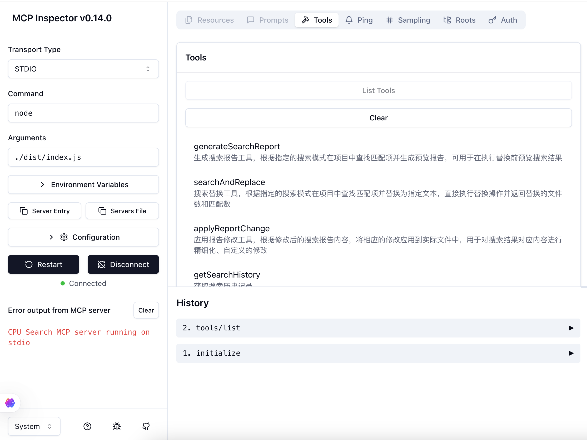

# 仿 vscode-search 的代码重构 mcp 工具

## 使用

### 在 cline 中使用

增加 mcp 工具设置：

```json
"cpu-vscode-search": {
  "command": "npx",
  "args": [
    "-y",
    "@cpu-search/mcp",
    "--root",
    "${workspaceFolder}"
  ],
  "disabled": false,
  "autoApprove": []
}
```

### MCP 工具使用示例

#### 搜索报告生成

```javascript
// 生成搜索报告
generateSearchReport({
  searchPattern: 'someText',
  // rootPath参数可省略，会使用命令行--root参数值
  options: { include: ['*.ts', '*.tsx'], exclude: ['node_modules/**'] },
});
```

运行后返回 vscode 搜索「在编辑器中打开」的同款搜索报告，如下：

```
23 个结果 - 6 文件

src/components/base/ReactG6.tsx:
   4
   5: export const ReactG6 = (props: {
   6    data: GraphData | TreeGraphData | undefined;
   7    options: Omit<GraphOptions, 'container'>;
   8:   domAttributes?: React.DetailedHTMLProps<React.HTMLAttributes<HTMLDivElement>, HTMLDivElement>;
   9  }) => {
  10:   const { data, options, domAttributes = {} } = props;
  11    const { className = '', ...restDomAttributes } = domAttributes;

src/components/end-graph/EndGraph.tsx:
   4
   5: interface EndGraphProps {}
   6

  84
  85: export const EndGraph = (props: EndGraphProps) => {
  86    return <ReactG6 data={data} options={staticOptions} />;

...
```

#### 应用报告修改

可以输入上述搜索报告中的修改后版本，直接diff修改并应用到代码中。

```javascript
// 应用报告修改
applyReportChange({
  reportText: 'generateSearchReport 报告修改后的内容',
  // rootPath参数可省略，会使用命令行--root参数值
});
```

#### 搜索并替换

```javascript
// 搜索并替换
searchAndReplace({
  searchPattern: 'oldText',
  replaceText: 'newText',
  // rootPath参数可省略，会使用命令行--root参数值
  options: { caseSensitive: true },
});
```

## 开发

1. pnpm start

2. 点击 mcp inspector 的链接：🔍 MCP Inspector is up and running at http://127.0.0.1:6274 🚀
使用 mcp 包默认的网页面板进行调试
3. 在网页面板连接 mcp 工具，然后就可以在这个面板自由调试了
